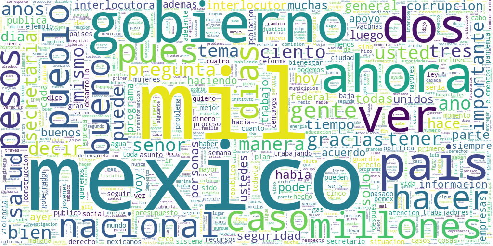

Ayer usando el [primer dataset de la conferencia matutina de AMLO que mencioné el otro día](https://bitacoraml.com/2022/03/scraper-conferencia-matutina-amlo-version-alpha/) hice una nube de palabras (wordcloud), esto es una forma de visualizar que tantas veces aparece una palabra.

Hubo algunas palabras que tuve que ignorar ya que desde mi análisis y perspectivas no son palabras significativas que deban a aparecer.

También ayer un amigo, [Enrique Noriega](https://twitter.com/enoriega), me recomendó aplicar un Part Of Speech (POS) Tagging para solo incluir sustantivos, verbos y adjetivos.