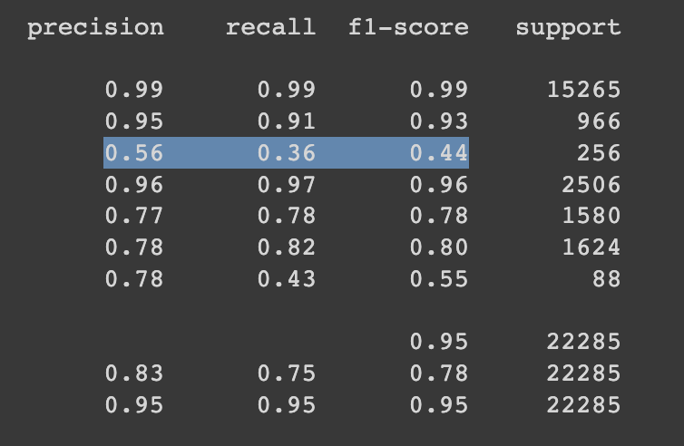

El mes pasado hice un [clasificador de texto con un 90% de accuracy](https://bitacoraml.com/2022/07/clasificador-de-texto-real/), mi primer pensamiento fue que algo estaba mal ya que era un accuracy muy alto para un modelo muy sencillo, solo un par de simples RNN (Recurrent Neural Networks).

Después de crear el [reporte de clasificación con scikit learn](https://scikit-learn.org/stable/modules/generated/sklearn.metrics.classification_report.html) con las predicciones del *testset* me quedó claro que hay algunas clases que están siendo mal clasificadas.

La definición de **precision** es dados todos los casos positivos, ¿Cuántos fueron clasificados correctamente?.

La definición de **recall** es dadas todas las predicciones positivas del modelo, ¿Cuántas son de verdad positivas?

En la clase subrayada en el screenshot podemos ver que el modelo solo pudo clasificar correctamente 56% de los casos positivos, mientras que de todas las veces que clasificó en ese clase solo el 36% fueron correcto.

Analizando el reporte podemos ver que este modelo clasifica pobremente en muchas de las clases del dataset. Por lo tanto es trabajar para mejorar los números en todas estas clases.

Siguiente pasos:

* Entrenar un modelo usando técnicas para datasets no balanceados (unbalanced datasets)
* Entrenar un modelo usando transfer learning, e.g. [BERT](https://en.wikipedia.org/wiki/BERT_(language_model)) u otro modelo disponible en [huggingface](https://huggingface.co/)