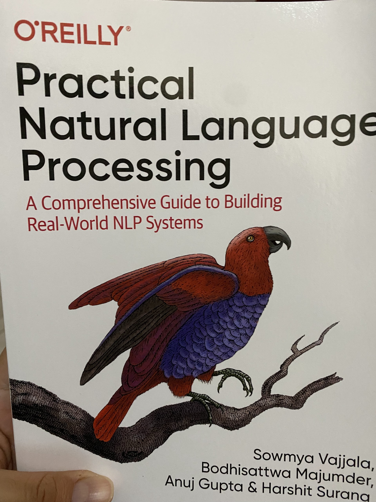

Hace un par de semanas empecé a leer el libro [Practical Natural Language Processing: A Comprehensive Guide to Building Real-World NLP Systems,](https://www.goodreads.com/en/book/show/48816582) escrito por Sowmya Vajjala, Bodhisattwa Majunder, Anuj Gupta y Harshit Surana.

Ya leí los primeros cuatro capítulos.

\- El primero es una introducción a NLP.

\- El segundo describe los métodos actuales de pre-procesamiento de texto y su recolección de texto de diversas fuentes así como la limpieza de los mismos.

\- El tercero habla de como representar el texto para que sea una entrada adecuada para entrenar un modelo usando Machine Learning, e.g. one-hot encoding, bag of words y embeddings.

\- El cuarto ya entra a clasificar texto usando diferentes formas de representación de texto, como entrenar tus propios embeddings o usar embeddings pre-entrenados como word2vec, también usar redes convolucionales de una dimensión, arquitecturas Long-Short Term Memory (LSTM) que es una arquitectura Redes Neuronales Recurrentes (RNN), así como también usar modelos pre-entrenados como BERT para dichas tareas de clasificación.

Voy empezando el capítulo cinco que habla de Extracción de Información o en inglés Information Extraction (IE). En siguientes entradas les comentaré mi progreso sobre el tema.

Aquí la portada del libro.

