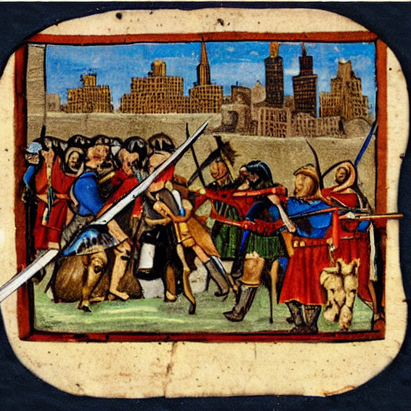
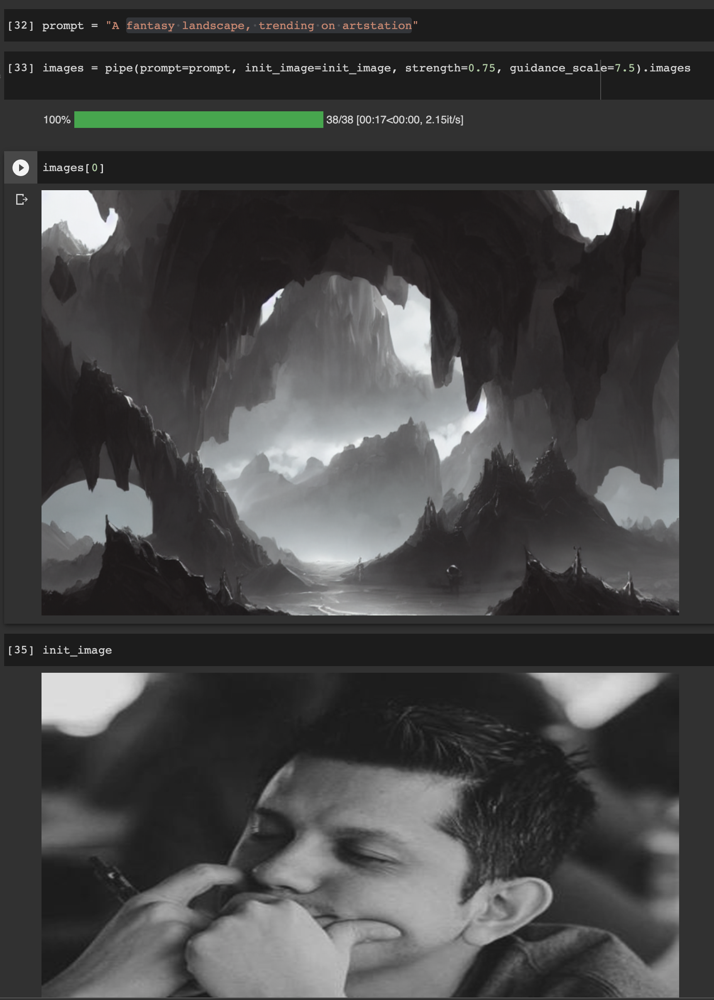
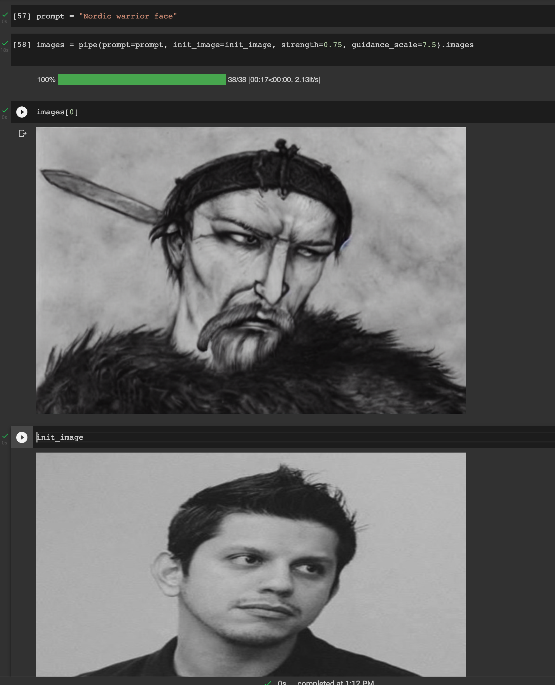
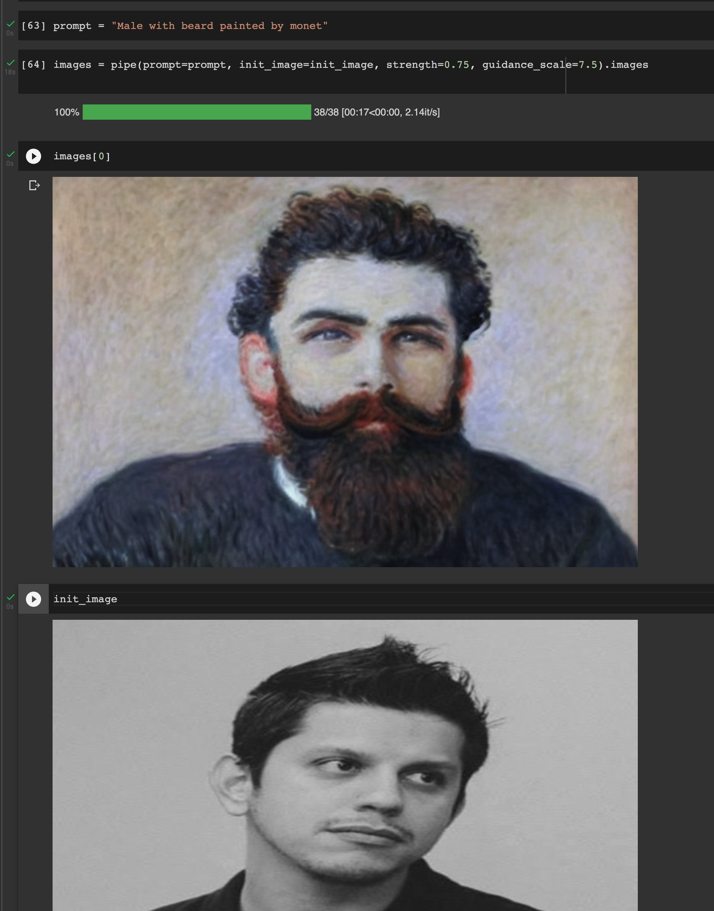

Hugging Face proporciona una librería llamada *diffusers* para facilitar el uso de estos modelos.

<https://github.com/huggingface/diffusers>

Ya jugué un poco con ese código en un [notebook](https://colab.research.google.com/drive/1P8cuo8JAFVxWQWsXgcUC78I6kihCXyJR#scrollTo=pVtXMKSdF_nu) pudiendo generar imagenes proporcionando un prompt y otras más proporcionando una imagen como template.

Notebook: <https://colab.research.google.com/drive/1P8cuo8JAFVxWQWsXgcUC78I6kihCXyJR#scrollTo=pVtXMKSdF_nu>

*Prompt*: "Medieval army fighting on new york city"

Luego seguí jugando agregando una imagen mia:

*Prompt*: "A fantasy landscape, trending on artstation"

*Prompt*: "Nordic warrior face"

*Prompt*: "Male with beard painted by monet"

