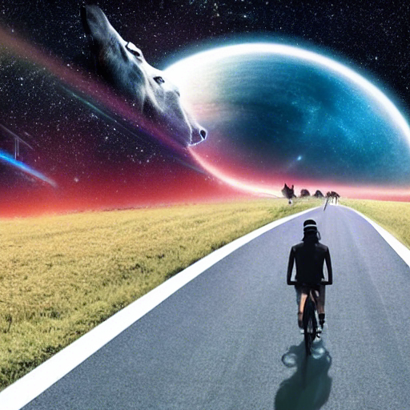

Primero intenté correr *Stable Diffusion* localmente en con un Docker para CPU, pero no pude lograrlo.

Después encontré un [tutorial de como correrlo localmente en el chip M1 de Mac](https://replicate.com/blog/run-stable-diffusion-on-m1-mac). Lo seguí y por fin pude correr *Stable Diffusion* localmente.

Debo decir que es extremadamente lento, ~30 min o mas para crear una imagen, usuando parámetros que a mi entender sería más rápido el procesamiento.

Modifiqué algunos de los parámetros y le pedí tres imagenes de pikachu y el tiempo estimado de procesamiento era 9 horas, no lo dejé terminar.

Aquí un par de imágenes generadas localmente en mi computadora:

***"a red juicy apple floating in outer space, like a planet"***

***"a human with a horse face riding a bicycle on a road through interstellar space"***

